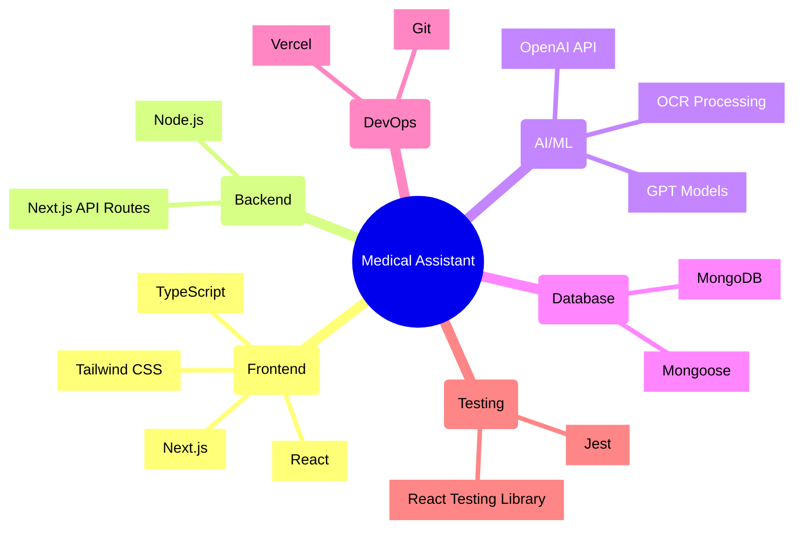

```mermaid
mindmap
  root((Medical Assistant))
    (Frontend)
      [Next.js]
      [React]
      [Tailwind CSS]
      [TypeScript]
    (Backend)
      [Next.js API Routes]
      [Node.js]
    (AI/ML)
      [OpenAI API]
      [GPT Models]
      [OCR Processing]
    (Database)
      [MongoDB]
      [Mongoose]
    (DevOps)
      [Git]
      [Vercel]
    (Testing)
      [Jest]
      [React Testing Library]
``` 