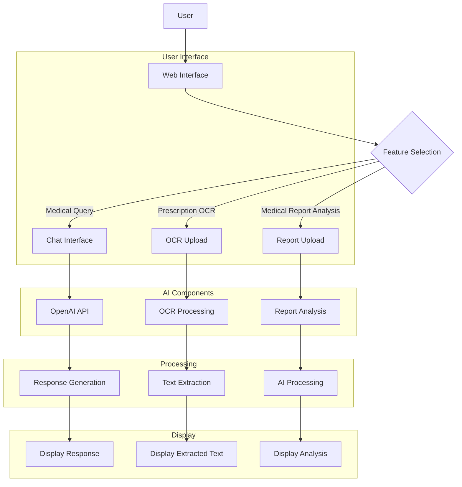

```mermaid
graph TD
    A[User] --> B[Web Interface]
    B --> C{Feature Selection}
    
    C -->|Medical Query| D[Chat Interface]
    C -->|Prescription OCR| E[OCR Upload]
    C -->|Medical Report Analysis| F[Report Upload]
    
    D --> G[OpenAI API]
    G --> H[Response Generation]
    H --> I[Display Response]
    
    E --> J[OCR Processing]
    J --> K[Text Extraction]
    K --> L[Display Extracted Text]
    
    F --> M[Report Analysis]
    M --> N[AI Processing]
    N --> O[Display Analysis]
    
    subgraph AI Components
        G
        J
        M
    end
    
    subgraph User Interface
        B
        D
        E
        F
    end
    
    subgraph Processing
        H
        K
        N
    end
    
    subgraph Display
        I
        L
        O
    end
``` 